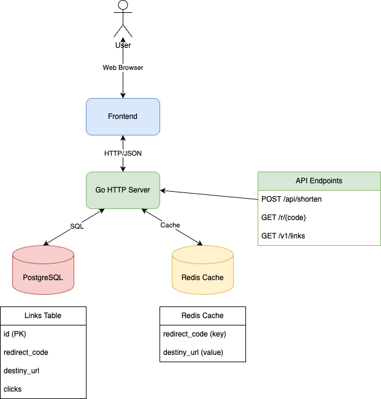
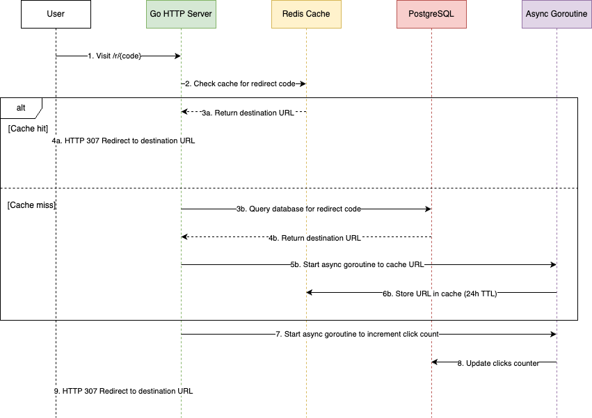

# Go URL Shortener

A modern URL shortening service built with Go, PostgreSQL, and Redis. This application allows users to create shortened URLs and tracks click statistics.

## Architecture

### Code Structure

```
go-url-shortener/
├── docker-compose.yml    # Docker configuration for PostgreSQL and Redis
├── go.mod                # Go module dependencies
├── go.sum                # Go module checksums
├── internal/             # Internal application code
│   ├── dependencies/     # Application dependencies and configuration
│   ├── handlers/         # HTTP request handlers
│   └── storages/         # Database and Redis connections
├── main.go               # Application entry point
├── schema.sql            # Database schema
└── web/                  # Frontend assets
    ├── app.js            # Main JavaScript for URL shortening
    ├── index.html        # Homepage
    ├── links.html        # Links management page
    ├── links.js          # JavaScript for links management
    └── styles.css        # CSS styles
```

### Component Overview

- **Backend (Go)**
  - RESTful API for URL shortening
  - PostgreSQL for persistent storage
  - Redis for caching frequently accessed URLs
  - Asynchronous processing for click tracking

- **Frontend**
  - Simple and responsive web interface
  - JavaScript for API interaction
  - Links management dashboard

## System Architecture Diagram



## Sequence Diagram: URL Redirection Flow



## Getting Started

### Prerequisites

- Docker and Docker Compose
- Go 1.24 or higher (for local development without Docker)

### Starting with Docker Compose

1. Clone the repository:
   ```bash
   git clone https://github.com/yourusername/go-url-shortener.git
   cd go-url-shortener
   ```

2. Start the PostgreSQL and Redis services:
   ```bash
   docker-compose up -d
   ```

   This will:
   - Start PostgreSQL on port 5432
   - Start Redis on port 6379
   - Initialize the database with the schema from `schema.sql`

3. Wait a few seconds for the services to fully initialize.

### Running the Application

#### Option 1: Run directly with Go

```bash
go run main.go
```

#### Option 2: Build and run the binary

```bash
go build -o url-shortener
./url-shortener
```

The application will start on port 8080 by default.

## Accessing the Application

- **Homepage**: [http://localhost:8080/](http://localhost:8080/)
  - Create new shortened URLs

- **Links Dashboard**: [http://localhost:8080/links.html](http://localhost:8080/links.html)
  - View all shortened URLs
  - Track click statistics

## API Endpoints

- `POST /api/shorten` - Create a new shortened URL
  ```json
  {
    "url": "https://example.com/very-long-url"
  }
  ```

- `GET /r/{code}` - Redirect to the original URL

- `GET /v1/links` - Get all links with statistics

## How It Works

1. **URL Shortening**:
   - User submits a URL to be shortened
   - System generates a unique code
   - URL and code are stored in PostgreSQL

2. **URL Redirection**:
   - When a user visits a shortened URL
   - System first checks Redis cache
   - If not in cache, it queries PostgreSQL
   - User is redirected to the original URL
   - Click count is incremented asynchronously
   - URL is cached asynchronously in Redis for future requests

## Notes

This is a demo project created using Windsurf, a powerful agentic AI coding assistant. The entire codebase was generated with the help of Windsurf AI, showcasing how artificial intelligence can be leveraged to rapidly develop functional web applications with modern architecture and best practices.

This README documentation was also written by Windsurf.
